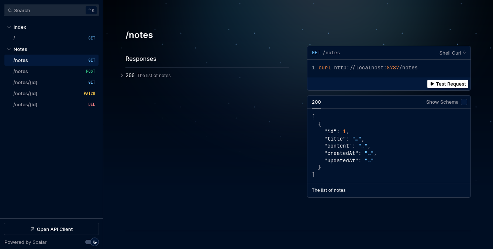
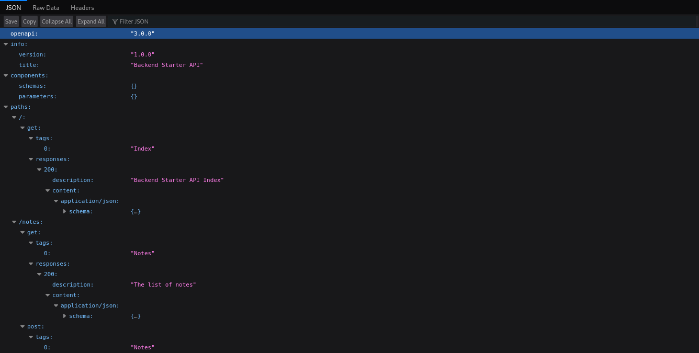
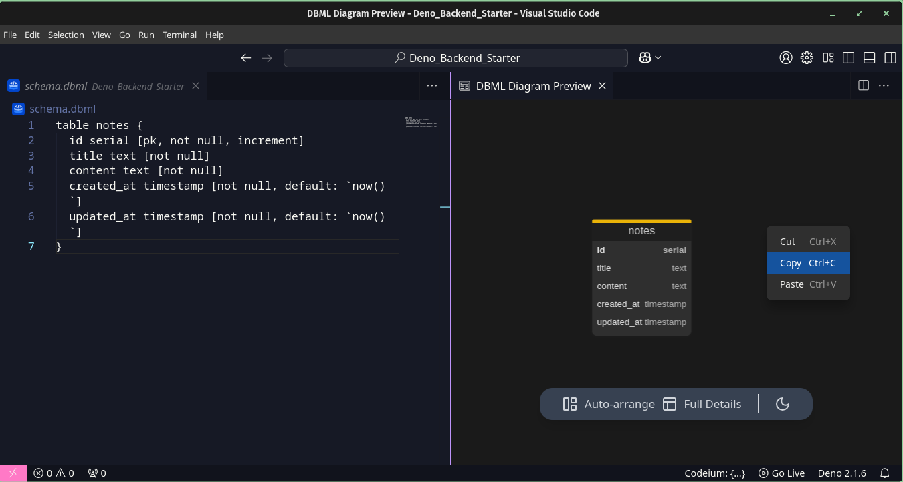

# Deno Backend Starter

=======================

This project is a Deno backend starter that uses Hono, Drizzle ORM, and Postgres DB. It can be configured to use Node or Bun, and other databases can be used by referring to the Drizzle documentation.

## Technologies Used

---

- [Hono](https://hono.dev/): A cross-runtime framework similar to Express.
- [Drizzle ORM](https://orm.drizzle.team/docs/overview): A simple and efficient TypeScript ORM with many features.
- [Deno](https://deno.com/): A runtime environment created by the creator of Node.js to fix Node.js mistakes.
- [Postgres DB](https://www.postgresql.org/): One of the best and well-known databases.

## Project Structure

---

- `src/commands`: Deno command files.
- `src/db/models`: Model files, use the convention `sample.model.ts`.
- `src/lib/configure-open-api`: Open API spec configuration.
- `src/lib/create-app`: Router without middleware and app configuration.
- `routes`: Route files, divided into three files:
  - `sample.routes.ts`: Definition for handler with type system for handler and Open API doc.
  - `sample.handlers.ts`: Actual handler that interacts with the database.
  - `sample.index.ts`: Binds definition with handler and shows errors on development.

## Getting Started

---

### Installation

- Run `deno install` to install dependencies.

### Development Server

- Run `deno task dev` to start the development server.

### Static Server

- Run `deno task serve` to start the static server.

### Database

- Run `deno task generate` to generate SQL migration files.
- Run `deno task migrate` to apply the migration.
- Run `deno task push` to instantly apply changes.
- Run `deno task seed` to seed data to the database.

* Check db.md for postgres related query to create db, user
* Should implement seeder based on model in command/seed

### Drizzle Studio

- Run `deno task studio` to open the frontend for your database - studio by Drizzle Studio.

### Linting and Checking

- Run `deno task check` to lint and check for errors with Drizzle Kit.
- Run `deno task update` to update dependencies.
- Run `deno task check-deps` to analyze dependencies with the version required and latest.

### DBML

- Run `deno task dbml` to generate database markup, which can be visualized with DBML support.

## Open API Documentation

---

- Visit `/doc` for JSON Open API documentation.
- Visit `/reference` for Swagger UI that uses the `/doc` and has interactive documentation.

This allows you to have a self-documenting API that is ready to test with Open API standards.

## Models

---

- Models should be defined in src/db/models.
- Use the convention \*sample.model.ts for model files.
- Drizzle Zod can be used to generate create, fetch, and patch types based on your models.
- These types can be used in your routes to define the shape of the data.

## Routes

---

- Import the route file with any alias and mount it in the `routes` array in `app.ts`.
- Example: `import sample from "@/routes/sample/sample.index.ts";`
- `const routes = [index, notes, sample] as const;`

After defining the route, you can visit the `/reference` route for interactive documentation of the new route.

## Samples

### open api interactive doc

### open api json doc

### auto generated er diagram - dbml

